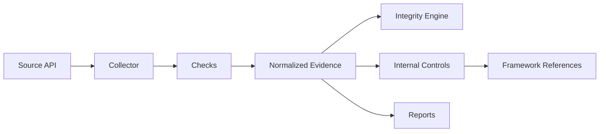

# SpectraSec Security Evidence Collector

**Collect. Normalize. Verify. Map.**

Open-source security evidence collection and control-mapping toolkit for audit and compliance workflows.

> Development status: **Alpha / v0.1-dev**. The project structure and CLI are being established. GitHub security evidence collection is the first planned collector and is not yet presented as production-ready.

## Why this exists

Security and compliance teams often collect technical evidence manually across repositories and platforms. This project aims to provide a deterministic, local-first pipeline:

```text
Source -> Collect -> Normalize -> Hash -> Map -> Report
```

The tool is designed to support evidence workflows. It does **not** determine regulatory compliance or certification status.

## Initial scope

The first collector will target GitHub and will focus on verifiable repository-security evidence such as repository metadata, branch governance, workflow configuration and selected security settings when the GitHub API exposes them reliably.

## Planned CLI

```bash
sec-evidence --help
sec-evidence version
sec-evidence collect github OWNER/REPOSITORY
sec-evidence verify ./evidence-pack
sec-evidence report ./evidence-pack
```

## Evidence principles

- deterministic collection and evaluation
- explicit `PASS`, `FAIL`, `UNKNOWN`, `NOT_APPLICABLE`, `ERROR` states
- UTC timestamps and provenance
- SHA-256 integrity verification for generated evidence artifacts
- raw evidence separated from normalized evidence
- control mappings separated from technical checks
- no LLM/API dependency required at runtime
- local-first processing and no telemetry

## Architecture



## Technology

- Python 3.12+
- GitHub REST API
- JSON / YAML / CSV / Markdown
- SHA-256
- pytest
- GitHub Actions

## Roadmap

- **v0.1** GitHub collector and evidence-pack foundation
- **v0.2** expanded GitHub security checks
- **v0.3** local/Linux evidence collector
- **v0.4** vulnerability evidence integration
- **v0.5** Azure evidence collector
- **v0.6** AWS evidence collector

## Security model

The tool is intended to operate read-only against source systems. Credentials must be supplied through environment variables and must never be written to evidence packs or logs.

## Compliance disclaimer

Framework mappings are provided to support evidence organization and control analysis. A technical check passing does not mean an organization is ISO 27001 compliant, NIS2 compliant, certified, or audit-ready.

## License

Apache-2.0.
