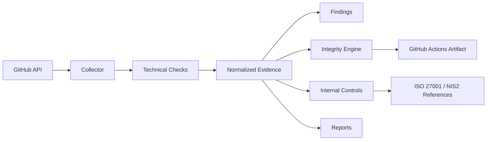

# SpectraSec Security Evidence Collector

**Collect. Normalize. Verify. Map.**

Open-source security evidence collection and control-mapping toolkit for audit and compliance workflows.

> Release status: **v0.1.0 release candidate**. CI, security checks, GitHub Pages and the end-to-end Evidence Automation workflow have been validated on `main`. The project remains an early open-source release and should be evaluated before production use.

## Open the project

- **Live tool:** https://cyber-g3.github.io/security-evidence-collector/
- **GitHub repository:** https://github.com/Cyber-G3/security-evidence-collector
- **Sanitized Evidence Pack demo:** https://github.com/Cyber-G3/security-evidence-collector/tree/main/examples/demo-evidence-pack
- **GitHub Actions:** https://github.com/Cyber-G3/security-evidence-collector/actions

The live page includes a **Public Quick Scan** for public GitHub repositories. Enter an `OWNER/REPOSITORY` value and select **Analyze** to inspect public repository-security signals without supplying a token. The full collector remains available through the CLI and GitHub Actions for deeper evidence collection.

## Why this exists

Security and compliance teams often collect technical evidence manually across repositories and platforms. This project provides a deterministic, local-first pipeline:

```text
Source -> Collect -> Normalize -> Hash -> Map -> Report
```

The tool supports evidence workflows. It does **not** determine regulatory compliance or certification status.

## Current GitHub checks

The current collector implements checks for:

- repository visibility
- default branch identification
- archived/active state
- `SECURITY.md` presence
- `CODEOWNERS` presence
- default-branch protection when readable through the API
- required pull-request reviews when branch protection is readable
- required status checks when branch protection is readable
- Dependabot configuration
- Dependabot security updates when exposed by the API
- secret scanning
- secret scanning push protection
- GitHub Advanced Security state when exposed by the API
- GitHub Actions execution policy
- SHA pinning policy for Actions
- default `GITHUB_TOKEN` workflow permissions
- workflow pull-request approval capability

Unavailable or permission-restricted settings are deliberately classified as `UNKNOWN`, not automatically as `FAIL`.

## CLI

```bash
sec-evidence --help
sec-evidence version
sec-evidence collect github OWNER/REPOSITORY --output ./evidence
sec-evidence verify ./evidence/evidence-pack-<UUID>
```

The collect command creates an integrity-verifiable Evidence Pack containing normalized evidence, deterministic findings, internal control mappings, ISO/IEC 27001:2022 and NIS2 supporting references, and a Markdown report.

## Automated evidence collection

The repository includes `.github/workflows/evidence-automation.yml`.

It can be launched manually with **workflow_dispatch**, runs weekly on Monday, and self-tests when relevant collector or workflow code changes. The workflow:

1. installs the project on GitHub-hosted Ubuntu;
2. collects evidence against the current repository;
3. generates a local Evidence Pack;
4. verifies the SHA-256 manifest;
5. uploads the verified pack as a GitHub Actions artifact for 30 days.

The workflow uses the built-in `GITHUB_TOKEN`; no external paid API or server is required for this self-assessment workflow. Permission-restricted GitHub settings are represented as `UNKNOWN` instead of aborting the collection.

## Evidence Pack

```text
evidence-pack-<UUID>/
├── metadata.json
├── manifest.json
├── normalized/
│   └── github/
├── findings/
│   └── findings.json
├── controls/
│   └── check-control-mappings.json
├── frameworks/
│   └── framework-references.json
└── reports/
    └── report.md
```

A fully sanitized example is available under `examples/demo-evidence-pack/`. It contains fictitious repository identifiers only and is intended to demonstrate the evidence model without credentials or production data.

## Evidence principles

- deterministic collection and evaluation
- explicit `PASS`, `FAIL`, `UNKNOWN`, `NOT_APPLICABLE`, `ERROR` states
- UTC timestamps and provenance
- SHA-256 integrity verification for generated evidence artifacts
- control mappings separated from technical checks
- framework references separated from compliance determinations
- no LLM dependency required at runtime
- local-first processing and no telemetry

## Architecture



## Quality and security gates

The repository uses GitHub Actions for:

- Ruff linting
- strict Mypy type checking
- pytest on Python 3.12 and 3.13
- minimum 80% test coverage
- Bandit static security analysis
- pip-audit dependency vulnerability checks
- end-to-end Evidence Pack generation and integrity verification

## Technology

- Python 3.12+
- GitHub REST API
- JSON / YAML / Markdown
- SHA-256
- pytest / respx
- GitHub Actions

## Roadmap

- **v0.1** GitHub collector, Evidence Pack, mappings and scheduled automation
- **v0.2** expanded GitHub security checks and reporting
- **v0.3** local/Linux evidence collector
- **v0.4** vulnerability evidence integration
- **v0.5** Azure evidence collector
- **v0.6** AWS evidence collector

## Security model

The tool is intended to operate read-only against source systems. Credentials must be supplied through environment variables or GitHub Actions secrets and must never be written to evidence packs or logs.

## Compliance disclaimer

Framework mappings are provided to support evidence organization and control analysis. A technical check passing does not mean an organization is ISO 27001 compliant, NIS2 compliant, certified, or audit-ready.

## License

Apache-2.0.
